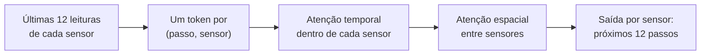

# VISU Predict

[English](README.md) · **Português (Portugal)**

[](https://github.com/almo-intellect/visu-predict/actions/workflows/ci.yml)
[](https://www.python.org/downloads/)
[](LICENSE)
[](https://colab.research.google.com/github/almo-intellect/visu-predict/blob/main/notebooks/benchmark_colab.ipynb)

**Previsão de tráfego para redes de sensores rodoviários.** O VISU Predict lê a última hora
de leituras de cada sensor (12 passos de 5 minutos) e prevê a hora seguinte para todos ao
mesmo tempo. Usa um Transformer espácio-temporal ao nível do sensor, a versão V19 do modelo
de tráfego VISU.

O repositório inclui:

- **O protocolo padrão do METR-LA / PEMS-BAY**, para que os resultados se comparem
  diretamente com os publicados.
- **As ferramentas para os reproduzir:** transferência dos dados, receitas de treino,
  estatísticas entre sementes e ensembles.

## Resultados em resumo

MAE de teste em mph a 15 / 30 / 60 minutos (quanto menor, melhor). As linhas V19 são médias
de três treinos com sementes (seeds) diferentes.

| Modelo | METR-LA | PEMS-BAY |
|---|---|---|
| **V19** | **2,70 / 3,01 / 3,38** | **1,35 / 1,65 / 1,90** |
| V19 + históricos do dia e da semana anteriores | 2,73 / 3,07 / 3,46 | 1,33 / 1,58 / 1,80 |
| V19, ensemble dos 3 treinos | 2,66 / 2,97 / 3,33 | 1,32 / 1,61 / 1,85 |
| STAEformer (CIKM 2023) | 2,65 / 2,97 / 3,34 | 1,31 / 1,62 / 1,88 |
| Graph WaveNet (IJCAI 2019) | 2,69 / 3,07 / 3,53 | 1,30 / 1,63 / 1,95 |
| DCRNN (ICLR 2018) | 2,77 / 3,15 / 3,60 | 1,38 / 1,74 / 2,07 |
| V18 (modelo VISU anterior) | 3,64 / 3,79 / 4,11 | 2,15 / 2,24 / 2,39 |
| Repetir a última leitura | 4,02 / 5,09 / 6,80 | 1,59 / 2,17 / 3,04 |

- **Face ao V18:** o erro médio desce 22% no METR-LA e 30% no PEMS-BAY, com cerca de metade
  dos parâmetros.
- **Face à literatura:** fica a poucos por cento dos melhores modelos revistos por pares.

As tabelas completas (RMSE, MAPE, dispersão entre sementes), a comparação com os modelos
publicados, a classificação no METR-LA e as ablações estão em
**[docs/results.md](docs/results.md)** (em inglês).

## Início rápido

```bash
pip install "visu-predict @ git+https://github.com/almo-intellect/visu-predict"

visu-predict download                       # METR-LA + PEMS-BAY (160 MB) para ./data
visu-predict baselines --dataset METR-LA    # verificação: repetir a última leitura dá MAE médio 5,14
visu-predict train --dataset METR-LA        # treina e testa o V19; resultados em ./runs/<nome-do-treino>/
```

- **GPU.** O treino usa a GPU automaticamente. Se for preciso, instale primeiro uma versão
  do PyTorch com CUDA (ver [pytorch.org](https://pytorch.org/get-started/locally/)). Numa
  A100 ou L4, acrescente `--precision bf16 --compile` para treinar mais depressa.
- **CPU.** Chega para os testes e para experimentar, mas um treino completo precisa de GPU
  (entre uma e algumas horas).
- **Sem GPU local?** Use o [notebook do Colab](notebooks/benchmark_colab.ipynb).

Cada treino escreve em `runs/<nome-do-treino>/`:

| Ficheiro | Conteúdo |
|---|---|
| `results.json` | MAE / RMSE / MAPE de teste por horizonte, opções de treino, tempos |
| `train_log.txt`, `history.json` | registo por época (gravado a cada época, para poder ser acompanhado no Google Drive) |
| `best.pt` | melhores pesos, autossuficiente (inclui a configuração do modelo e a normalização) |
| `last.pt` | estado completo do treino, usado por `--resume` |
| `test_predictions.npz` | com `--save-predictions`; necessário para `visu-predict ensemble` |

## Comandos

| Comando | O que faz |
|---|---|
| `visu-predict download` | Transfere os ficheiros do METR-LA / PEMS-BAY ([DATA.md](DATA.md)) |
| `visu-predict baselines --dataset D` | Avalia as referências ingénuas (repetir a última leitura, média histórica) |
| `visu-predict train --dataset D` | Treina com paragem antecipada e mostra as métricas de teste |
| `visu-predict evaluate runs/<treino>` | Volta a avaliar um treino e, se pedido, guarda as previsões |
| `visu-predict aggregate runs/` | Média ± desvio-padrão de treinos que só diferem na semente |
| `visu-predict ensemble runs/a runs/b ...` | Avalia a média das previsões de vários treinos |
| `visu-predict queue --queue ficheiro.json` | Corre muitos treinos, alguns de cada vez numa GPU, e retoma os interrompidos |
| `visu-predict weather` | Cria ficheiros horários de meteorologia ERA5 para um conjunto de dados |

Todos os comandos têm `--help`. Opções frequentes do `train`:

| Opção | Para quê |
|---|---|
| `--seed 43` | outra semente de treino |
| `--history-lags 288 2016` | junta as leituras da mesma hora do dia anterior e da semana anterior |
| `--weather`, `--holidays` | entradas adicionais |
| `--graph-bias` | informação da rede viária na atenção |
| `--model legacy` | treina o V18 com o mesmo protocolo |
| `--epochs`, `--lr` | altera a receita de treino |

## Os seus próprios dados

Ponha `MINHACIDADE.csv` (primeira coluna: datas e horas; depois uma coluna por sensor) em
`data/` e corra:

```bash
visu-predict baselines --dataset MINHACIDADE
visu-predict train --dataset MINHACIDADE
```

As leituras iguais a `0` contam como em falta. A matriz de adjacência
(`adj_MINHACIDADE.pkl` / `.npy`) só é necessária para `--graph-bias`. Para juntar
meteorologia, indique a localização da rede:
`visu-predict weather --datasets MINHACIDADE --lat -25.97 --lon 32.57 --tz Africa/Maputo`.

Para partir de um modelo treinado numa rede grande, veja
[transferência para outra rede](docs/architecture.md#transfer-to-another-network). Os
formatos dos ficheiros estão em [DATA.md](DATA.md).

## API em Python

```python
import torch
from visu_predict import STTrainConfig, STTransformer, fit, load_checkpoint, load_st_benchmark

data = load_st_benchmark("data", "METR-LA", batch_size=16, device="cuda")
model = STTransformer(num_nodes=data.num_nodes, steps_per_day=data.steps_per_day)
results = fit(model, data, STTrainConfig(max_epochs=200, precision="bf16"),
              run_dir="runs/metr-la", device="cuda")
print(results["test"]["h12"])          # MAE / RMSE / MAPE a 60 minutos

# mais tarde: reconstruir o modelo treinado e prever um lote
model, scaler, _ = load_checkpoint("runs/metr-la/best.pt", device="cuda")
batch = next(iter(data.test))          # x: (B, 12, N, 1) leituras normalizadas; tod / dow: índices de calendário
with torch.no_grad():
    forecast = scaler.inverse_transform(model(batch["x"], batch["tod"], batch["dow"]))   # (B, 12, N) mph
```

## Como funciona



Cada token (passo, sensor) junta a leitura, a hora do dia, o dia da semana e uma
representação aprendida de cada sensor. Seguem-se três camadas de atenção temporal e três de
atenção espacial (desenho do STAEformer, 1,26 M de parâmetros no METR-LA).

O treino segue o protocolo padrão: divisão cronológica 70/10/20, MAE com máscara sobre as
velocidades originais e janelas de teste iguais às da literatura. Detalhes em
[docs/architecture.md](docs/architecture.md) (em inglês).

## Reproduzir os resultados publicados

```bash
visu-predict download
visu-predict queue --queue configs/paper_runs.json --max-concurrent 3   # os 17 treinos
visu-predict aggregate runs/
visu-predict ensemble runs/METR-LA_st_base runs/METR-LA_st_base_s43 runs/METR-LA_st_base_s44
```

A fila salta os treinos já terminados e retoma os interrompidos, por isso basta voltar a
lançá-la depois de uma desconexão do Colab. As métricas dos treinos publicados estão em
[`results/`](results).

## Estrutura do projeto

```
src/visu_predict/
├── data.py          # dados do benchmark: janelas, divisão, normalização, calendário, meteorologia
├── model.py         # STTransformer (+ informação da rede viária, transferência para outras redes)
├── training.py      # ciclo de treino, paragem antecipada, checkpoints, avaliação, referências
├── metrics.py       # MAE / RMSE / MAPE com máscara, por horizonte
├── benchmark.py     # comandos train / baselines / evaluate
├── analysis.py      # estatísticas entre sementes e ensembles
├── job_queue.py     # fila de treinos
├── weather.py       # criação dos ficheiros ERA5
├── download.py      # transferência dos dados
├── cli.py           # comando `visu-predict`
└── legacy/          # TrafficTransformer V18 (pip install "visu-predict[legacy]")
configs/paper_runs.json   # todos os treinos por trás de docs/results.md
notebooks/                # notebook do Colab
results/                  # métricas dos treinos publicados
docs/                     # resultados e arquitetura
tests/                    # testes pytest (CPU, cerca de 30 s)
```

## Versões

- **`main`**: V19, versão 0.2.0 do pacote ([CHANGELOG](CHANGELOG.md)).
- **Etiqueta [`v0.1.0`](https://github.com/almo-intellect/visu-predict/tree/v0.1.0)**: o
  pacote anterior (Transformer codificador-descodificador V14, com pré-codificador GNN
  opcional).
- **Ramos `COLAB_NOBASELINE_V*`**: cópias das pastas de trabalho do Colab. O V19 desses ramos
  é o mesmo modelo do `main`, na organização de ficheiros original.
- **`sota-upgrade`**: extensões experimentais do pacote 0.1.0 (mistura de especialistas,
  Mamba, patching, pré-treino), não avaliadas com este protocolo.

## Desenvolvimento

```bash
git clone https://github.com/almo-intellect/visu-predict && cd visu-predict
pip install -e ".[dev,legacy]"
pytest                 # cerca de 30 s em CPU; VISU_DATA_DIR=<pasta dos dados> acrescenta os testes com dados reais
ruff check src tests
```

Ver [CONTRIBUTING.md](CONTRIBUTING.md).

## Licença

MIT, © Almo Intellect. Ver [LICENSE](LICENSE).

## Autores

- Lauro Mota (`lauro.mota@almo.co.mz`), autor principal
