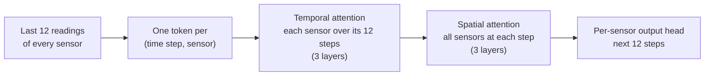

# How V19 works

V19 is a node-level spatio-temporal Transformer from the STAEformer family
(Liu et al., CIKM 2023), re-implemented with a few extensions. The code is in
[`src/visu_predict/model.py`](../src/visu_predict/model.py).

## The model



Every (time step, sensor) pair becomes a 152-wide token, the concatenation of:

| Part | Size | Content |
|---|---|---|
| Value projection | 24 | the (z-scored) speed reading |
| Time-of-day embedding | 24 | one of 288 five-minute slots |
| Day-type embedding | 24 | day of the week, optionally "holiday" as an 8th type |
| Spatio-temporal adaptive embedding | 80 | learned per (input position, sensor): 12 × N × 80 |
| Weather embedding (optional) | 16 | city-level covariates, the same for all sensors |

The tokens pass through 3 temporal attention layers, where each sensor attends over its own
12 steps, and 3 spatial attention layers, where all sensors attend to each other at each
step. Each layer has 4 heads, a 256-wide feed-forward block, dropout 0.1 and post-LayerNorm.
A linear head then maps each sensor's 12 × 152 representation to its next 12 readings.
That head runs in fp32 even under mixed precision, because predictions are scaled back by
the speed standard deviation and bf16 rounding would add visible noise.

The model has 1.26 M parameters on METR-LA (207 sensors) and 1.37 M on PEMS-BAY (325).

**Fused attention.** PyTorch's fast attention kernels need a head size that is a multiple of
8, but 152 / 4 heads = 38. Heads are therefore zero-padded to 40 inside attention, with the
original 1/√38 scaling. The output is mathematically identical, and PyTorch can use its fused
kernels instead of a much slower fallback that builds every attention matrix in memory.

### Options

| Option | Effect | Measured effect on the benchmarks |
|---|---|---|
| `--history-lags 288 2016` | adds, for each input step, the reading from the same time yesterday and last week (only past data) | real gain on PEMS-BAY, none on METR-LA |
| `--graph-bias` | Graphormer-style spatial prior: a learned bias per head and shortest-path hop distance on the road graph, both directions, starting at zero | no gain |
| `--weather` | hourly weather embedded and broadcast to all sensors, with an availability flag | slightly worse (dry test periods) |
| `--holidays` | public holidays become an 8th day type | not measured on the benchmarks |
| `--norm-first` | pre-LayerNorm blocks | not used for the published runs |

## The benchmark protocol

Everything follows the conventions of the published METR-LA / PEMS-BAY results, so numbers
are directly comparable:

- **Windows.** 12 steps in, 12 steps out, split 70 / 10 / 20 by window index as in DCRNN's
  `generate_training_data.py`. The test windows are the same as in the literature
  (METR-LA 6,850; PEMS-BAY 10,419).
- **Raw targets.** Zero readings are sensor faults. They stay in the data, are excluded from
  the loss and from every metric, and are never replaced by an average.
- **No leakage.** Inputs are z-scored with the mean and standard deviation of the training
  period only. History lags only reach back to data before the window.
- **Metrics.** Masked MAE, RMSE and MAPE on the original mph scale, at horizons 3, 6 and 12
  (15, 30, 60 minutes) and pooled over all 12 steps.

## Training recipe

The STAEformer recipe:

- **Loss and optimiser.** Masked MAE on the original scale, Adam with learning rate 1e-3,
  batch size 16.
- **Weight decay and learning-rate drops.** 3e-4 on METR-LA, with the learning rate falling
  ×0.1 at epochs 20 and 30. On PEMS-BAY, 1e-4 with drops at epochs 10 and 30.
- **Early stopping.** On validation MAE, with patience 30 (METR-LA) or 20 (PEMS-BAY).
  Training is capped at 200 / 300 epochs.

Every option can be overridden on the command line (`visu-predict train --help`).

- **Checkpoints.** Each epoch writes `last.pt` (full state, for `--resume`) and, when
  validation improves, `best.pt`. Writes go through a temporary file, so an interrupted save
  never leaves a broken checkpoint. `best.pt` also stores the model class, its configuration
  and the scaler, so `load_checkpoint()` and `visu-predict evaluate` can rebuild the model
  from that one file.
- **Logs.** `train_log.txt` and `history.json` are flushed every epoch, so a run folder on
  Google Drive can be watched while it trains.
- **Speed.** `--precision bf16 --compile` is the fastest setting on A100 / L4 GPUs. The final
  test pass always runs in full precision.

## Transfer to another network

All weights except the sensor-specific embeddings are shared across sensors. A model
trained on a large network can therefore be moved to a new one, for example a city with
little history:

```python
from visu_predict import load_checkpoint, load_st_benchmark, fit, STTrainConfig

model, _, _ = load_checkpoint("runs/PEMS-BAY_st_base/best.pt")
target = load_st_benchmark("data", "MYCITY")
model.adapt_to_graph(target.num_nodes, adj=target.adj, freeze_shared=True)
fit(model, target, STTrainConfig(max_epochs=50, lr=1e-3), run_dir="runs/mycity_transfer", device="cuda")
```

`adapt_to_graph` re-initialises the node and adaptive embeddings for the new sensor count.
It keeps every attention and feed-forward layer, the output head and the hop-distance bias
tables. With `freeze_shared=True` only the new embeddings (and the graph-bias tables) train,
for few-shot fine-tuning. Unfreeze later for full fine-tuning (`p.requires_grad = True`).

Source and target must share the same time resolution (the time-of-day embedding has one entry
per slot of the day, 288 for 5-minute data) and the same input options: history lags,
holidays and weather.

## Why V18 was replaced

V18 (`visu_predict.legacy`) treated sensors as features:

- **One token per time step.** All N sensors were packed into a single token, attended over
  the 12 tokens, mean-pooled, and mapped one vector to all 12 × N outputs.
- **No notion of sensors.** It had no sensor identity, no weights shared across sensors and
  no spatial reasoning.
- **Overfitting.** Train MAE was 1.33 against 2.20 on validation, and a larger model did
  worse (38 M parameters: validation loss 0.037 against 0.035 at 2.8 M).
- **Leaky evaluation.** Its evaluation replaced missing readings with sensor means and used
  time features that took values never seen in training, so its own scores were not
  comparable with the literature.

Under the standard protocol V18 scores 2.25 average MAE on PEMS-BAY. Repeating the last
reading scores 2.17.
